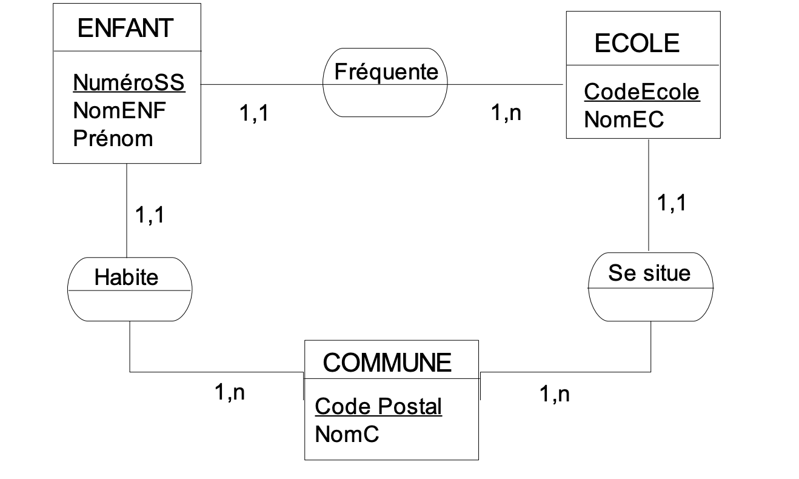
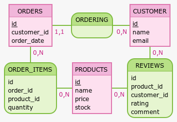

# Controle

## Table des matières <!-- omit in toc -->

- [Controle](#controle)
  - [Pré-requis](#pré-requis)
  - [Rendu](#rendu)
  - [Exercices](#exercices)
    - [Exercices dictionnaire /4](#exercices-dictionnaire-4)
      - [Ecole](#ecole)
      - [Librairie - dictionnaire](#librairie---dictionnaire)
    - [Exercices MCD /8](#exercices-mcd-8)
      - [Ecommerce](#ecommerce)
      - [Banque](#banque)
      - [Kebab](#kebab)
      - [Entreprise](#entreprise)
    - [Exercices programmation /8](#exercices-programmation-8)
      - [Librairie - requêtes](#librairie---requêtes)
      - [Ecommerce - requêtes](#ecommerce---requêtes)
      - [Exposition d'art](#exposition-dart)
      - [Gestion de stock](#gestion-de-stock)

## Pré-requis

Vous devez savoir ce qu'est un dictionnaire de données, un MCD, programmer une base de données simple et faire des requêtes SQL simples.

Vous devez avoir un compte github.

## Rendu

1. forker ce projet en cliquant sur ce bouton :

Github will clone this repository on your account so you won't modify this template.

Github va ainsi copier ce repository sur votre compte. Vous pourrez travailler sur votre version, et non pas sur ce modèle.

2. Pour chaque exercice, créez un dossier avec comme nom le numéro de l'exercice.

Par exemple pour l'exercice 3, vous créerez un dossier `/Exercice-3`.

3. Vous mettrez dans ces dossiers les fichiers attendus pour répondre aux exercices (tableau pour les dictionnaires de données, image pour les MCD, fichier `.txt` pour les questions à répondre et fichier `.sql` lorsque de la programmation vous est demandé).

Par exemple pour l'exercice 4, vous aurez donc un fichier `/Exercice-4/dictionnaire.csv` et un fichier `/Exercice-4/mcd.png` .

4. Une fois le devoir terminé, vous ferez une Pull Request depuis la page github de votre repository :

Le titre de votre Pull Request devra contenir votre nom, votre prénom et votre classe.

## Exercices

### Exercices dictionnaire /4

Faire un dictionnaire pour chacun des sujets suivants.

#### Ecole

Utiliser le mcd suivant pour en faire un dictionnaire de données.

#### Librairie - dictionnaire

Utiliser le script sql [suivant](assets/CONTROLE/sql/library.sql) pour en faire un dictionnaire de données.

### Exercices MCD /8

Faire un MCD pour chacun des sujets suivants.

#### Ecommerce

Utiliser le script sql [suivant](assets/CONTROLE/sql/ecommerce.sql) pour en faire un MCD.

#### Banque

| Property     | Comment     | Entity        | Type        | Identifier |
| ------------ | ----------- | ------------- | ----------- | ---------- |
| firstname    |             | clients       | VARCHAR     |            |
| lastname     |             | clients       | VARCHAR     |            |
| phone        |             | clients       | VARCHAR     |            |
| email        |             | clients       | VARCHAR     | X          |
| id           |             | accounts      | VARCHAR     | X          |
| balance      |             | accounts      | FLOAT(11,2) |            |
| type         | FOREIGN KEY | accounts      | VARCHAR     |            |
| client       | FOREIGN KEY | accounts      | VARCHAR     |            |
| id           |             | transactions  | VARCHAR     | x          |
| from_account | FOREIGN KEY | transactions  | VARCHAR     |            |
| to_account   | FOREIGN KEY | transactions  | VARCHAR     |            |
| amount       |             | transactions  | FLOAT(6,2)  |            |
| date         |             | transactions  | DATE        |            |
| is_validated |             | transactions  | TINYINT(1)  |            |
| label        |             | account_types | VARCHAR     | x          |

#### Kebab

Un restaurant kebab veut créer une application pour permettre à ses clients de faire leurs propres recettes de sandwiches. Une recette est constituée d'une liste d'ingrédients, d'un nom, d'un tarif et d'un moyen de l'identifier. Les ingrédients ont un nom, un type et une disponibilité. Un type d'ingrédient est une liste qui permet de différencier la nature de l'ingrédient (sauce, pain, légume, viande, ...).

#### Entreprise

Une entreprise a besoin de faire la liste de ses salariés. Chaque salarié a un prénom, un nom, une date de naissance. Il est possible qu'un salarié ait un manager. Un manager est également un salarié.

### Exercices programmation /8

#### Librairie - requêtes

En vous basant ce script sql [suivant](assets/CONTROLE/sql/library.sql) :

1. afficher le nom et le prénom de tous les auteurs
2. afficher la liste des éditeurs qui ont une virgule dans leur nom
3. afficher la liste des emprunts qui sont en retards de retour
4. afficher le titre des livres dont le titre comporte moins de 50 caractères

#### Ecommerce - requêtes

En vous basant ce mcd 

 :

1. afficher toutes les quantités commandées du produit avec l'id 2456
2. afficher le nom de tous les produits qui ne sont plus en stock
3. afficher les commandes qui n'ont pas encore été livrée
4. afficher tous les clients qui ont une adresse email qui termine par `@gmail.com`

#### Exposition d'art

- Toute œuvre de l'exposition a un titre, un ou plusieurs auteurs, une date d'acquisition et un numéro de catalogue ;
- Une œuvre est exposée dans l'une des salles de l'exposition qui est caractérisée par un numéro, un nom, le nombre d'œuvres qu'elle contient, le type d'éclairage, ou est présente dans une autre exposition pour laquelle on connaît le début et la durée du prêt ;
- Certaines œuvres exposées peuvent avoir été empruntées à un particulier. Dans ce cas, on connaît le titre, le nom, le prénom et l'adresse du propriétaire, la date de début et la durée de l'emprunt ;
- Une œuvre doit alors être assurée. On connaît le montant de la prime d'assurance, la valeur pour laquelle l'œuvre est assurée, le nom et l'adresse de la compagnie qui l'assure;
- On souhaite garder la liste des particuliers qui ont prêté des œuvres. Pour chacun, on affichera ses titres, prénom, nom et adresse et les types d'œuvres qu'ils possèdent (art déco, art contemporain, antiquités, ...).

Écrire un script SQL pour réaliser cette base de données

#### Gestion de stock

- Dans l’entreprise GCIVIL, les produits (caractérisés par un code et une désignation et un prix unitaire) peuvent soit être fabriqués par l’entreprise ou provenir de différents fournisseurs (caractérisés par un numéro et un nom et une adresse).
- Un même produit peut provenir de plusieurs fournisseurs à des prix d’achat différents.
- Un fournisseur peut livrer plusieurs produits.

Écrire un script SQL pour réaliser cette base de données
